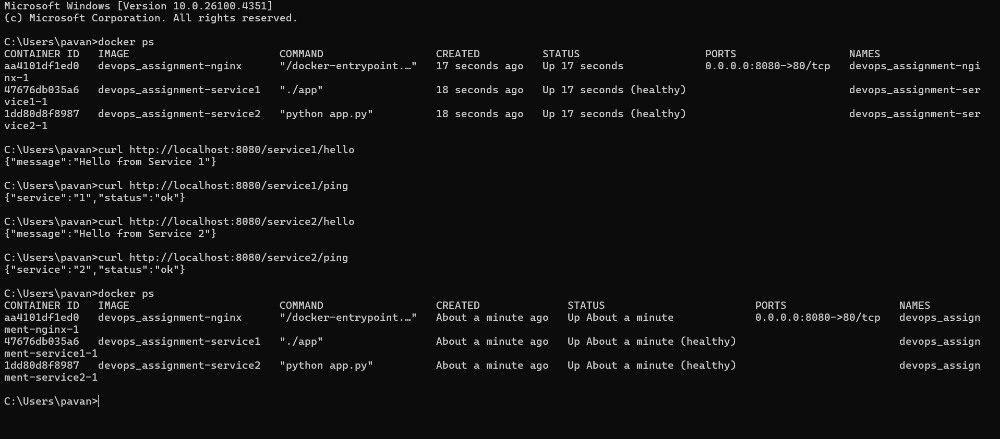

# 🐳 DevOps Internship Assignment — Nginx Reverse Proxy with Docker Compose

This project sets up two backend services — a Go service and a Python Flask service — both containerized and routed through an Nginx reverse proxy using Docker Compose.

---

## 📁 Folder Structure

```
.
├── docker-compose.yml
├── nginx
│   ├── Dockerfile
│   └── nginx.conf
├── service1  # Golang App
│   ├── app.go
│   ├── Dockerfile
│   └── go.mod
├── service2  # Python Flask App
│   ├── app.py
│   ├── Dockerfile
│   └── requirements.txt
├── screenshots
│   └── output.png
└── README.md
```

---

## 🚀 Setup Instructions

1. **Clone the repository**:

   ```bash
   git clone https://github.com/your-username/devops-assignment.git
   cd devops-assignment
   ```

2. **Run the system with one command**:

   ```bash
   docker-compose up --build
   ```

   This will:
   - Build all three containers (`service1`, `service2`, and `nginx`)
   - Start them in a custom bridge network
   - Expose everything on port `8080`

---

## 🌐 API Routing via Nginx

| Request                          | Proxied To                     |
|----------------------------------|--------------------------------|
| `localhost:8080/service1/ping`  | Go App → `localhost:8001/ping` |
| `localhost:8080/service1/hello` | Go App → `localhost:8001/hello`|
| `localhost:8080/service2/ping`  | Flask App → `localhost:8002/ping` |
| `localhost:8080/service2/hello` | Flask App → `localhost:8002/hello` |

---

## ❤️ Health Checks

Docker Compose uses `HEALTHCHECK` in each service:

- **Golang App**:
  ```dockerfile
  HEALTHCHECK CMD curl --fail http://localhost:8001/ping || exit 1
  ```
- **Python Flask App**:
  ```dockerfile
  HEALTHCHECK CMD curl --fail http://localhost:8002/ping || exit 1
  ```

This ensures that each service must be responsive at `/ping` to be considered healthy.

---

## 📸 Screenshots

### ✅ All Containers Healthy & curl Response Check



---

## ✅ Bonus Features

- Nginx logs all incoming requests (path + timestamp)
- Clean Docker setup with health checks
- Works with one simple command: `docker-compose up --build`

---

## 🧪 Test Endpoints

Once containers are up, test with:

```bash
curl http://localhost:8080/service1/hello
curl http://localhost:8080/service2/ping
```

Expected output:

```json
{"message": "Hello from Service 1"}
{"status": "ok", "service": "2"}
```
